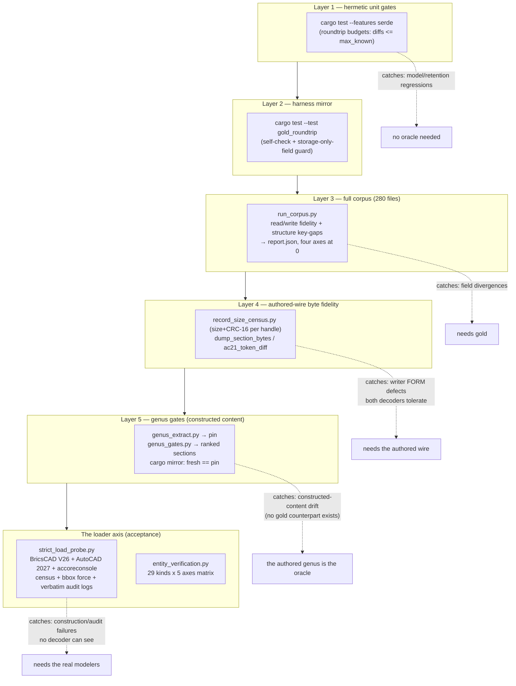
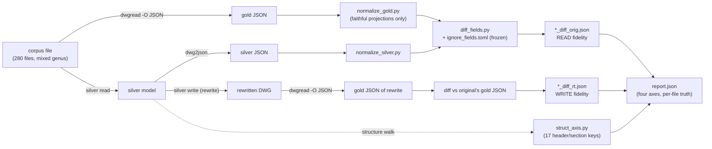
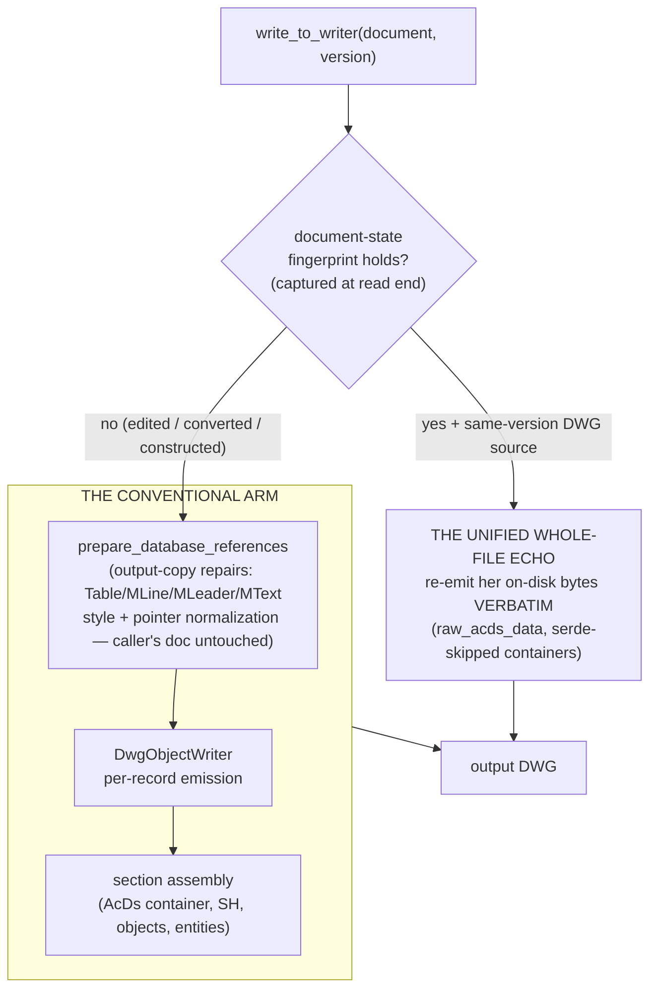
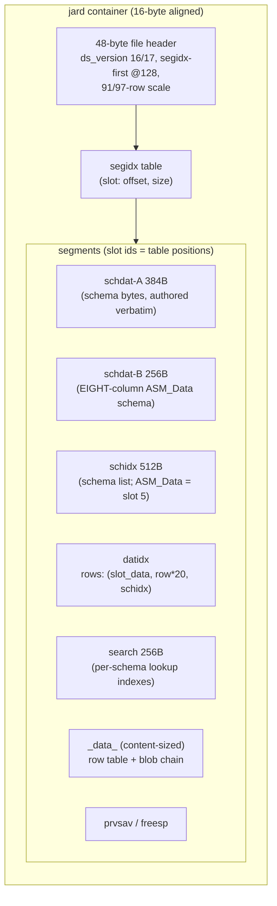
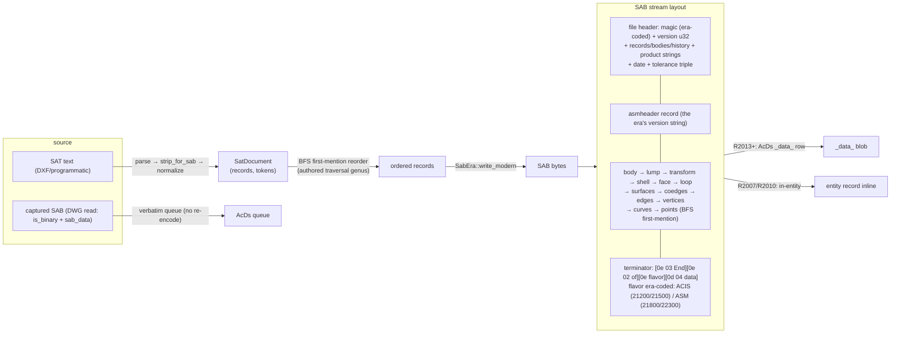
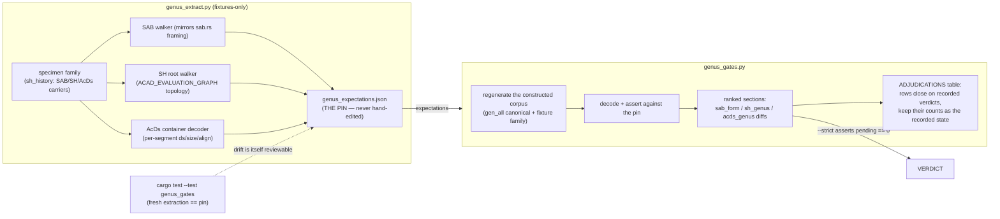
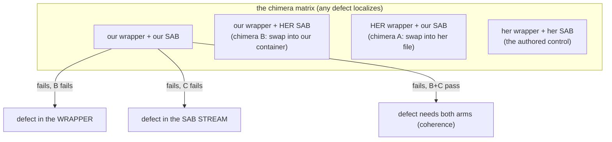
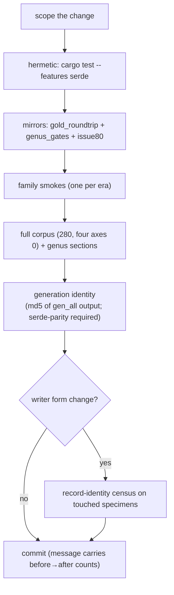

# ARCHITECTURE.md — the gold_harness design

The structural reference for the gold-vs-silver roundtrip harness: what each
component is, why it exists, and how the pieces connect. Campaign history and
queue state live in `IMPLEMENTATION.md` (the plan) and `NEXT_SESSION.md` (the
halt records); this file describes the *standing design* those records
operate on. Entry points: `README.md` (workflow), `AGENTS.md` (durable rules).

---

## 1. The problem shape

`acadrust` ("silver") reads and writes native DWG. Two independent oracles
judge correctness:

- **gold** — LibreDWG (`dwgread`), a second, independent decoder. It can only
  *read*: it exposes parser-parity defects (fields silver drops or misparses)
  but shares silver's leniency — two tolerant decoders agree on streams a
  strict consumer would reject.
- **the strict loaders** — BricsCAD V26 and AutoCAD 2027 (the format's
  author). They *construct* (regenerate B-reps, audit records) and reject
  byte-legal-but-divergent encodings both decoders accept.

No single oracle suffices, so the harness is a **stack of five validation
layers plus a loader axis**, each catching what the ones below it cannot:



The blind-spot chain that motivated each layer:

| Blind spot | Closed by |
|---|---|
| Unit tests assert silver-vs-silver — a shared codec bug passes | layer 3 (gold parity) |
| Both decoders are lenient — a *form* defect (legal bitcode choice A vs the author's B) passes | layer 4 (byte-compare the rewrite against the authored wire) |
| Constructed documents have no authored counterpart — layers 1–4 see nothing | layer 5 (the authored *genus* — measured invariants across the specimen family — becomes the expectation) |
| Decoders accept what modelers reject — construction never tested | the loader axis (the modeler's own census/audit words are the verdict) |

---

## 2. The corpus pipeline (layer 3)

`run_corpus.py` walks every corpus file through a read→diff→rewrite→diff
cycle. The differ (`diff_fields.py` + `ignore_fields.toml`) is **frozen during
the fix loop** — fixes belong in the codec, never in the differ.



Design invariants:

- **Normalizers are faithful projections, never data-hiding.** A normalizer
  may re-shape a value for comparison (e.g. pop writer-side codec channels
  that have no gold counterpart) but may not delete a real semantic
  difference. Every pop is loop-universal and documented.
- **`per_file` is truth; by-type tables truncate.** Corpus counts are
  stem-collision inflated (280 files → 196 unique stems) — use them for
  ranking only.
- **Header data is out of scope** (compared laxly); only the `OBJECTS` array
  is diffed exactly.
- **The four axes**: read fidelity, write fidelity, read structure key-gap,
  write structure key-gap — all held at 0.

The corpus is **mixed-genus on purpose** (ODA FileConverter stamps, AutoCAD
stamps, unmarked pre-R2004): wire conventions are content- and
generation-class facts, so byte attribution keys on a specimen's stamp and
content class, never on "which writer said so".

---

## 3. The write path (what layer 4 byte-compares)

Silver's DWG writer has two arms, chosen at the write entry:



- **The echo** is a byte-copy gated on a full-content hash: for an unedited
  same-version roundtrip the writer is a copier. The fingerprint
  (`document_state_fingerprint`) hashes the semantic inventory, the ten table
  control handles, and the retained metadata models; wire-only captures are
  excluded so codec-channel bookkeeping never blocks the echo.
- **The conventional arm** serves every other case. Its record emission is
  held to **record identity**: on every surveyed era specimen the rewrite's
  records match the author's on size + CRC-16 (`record_size_census.py`), with
  byte-passthrough replay for classes whose typed re-encode drifts (the
  520/528/529 wire-capture classes, DATATABLE raw passthrough, pre-2007
  MText wire text).
- **The output-copy repairs** fix *invalid authored states* (a null
  MLeader style pointer, a corrupt MText attachment repeat) only in the
  write's copy — the caller's document stays untouched, and authored
  captures that already carry valid values pass through verbatim.

### 3.1 The AcDs container (R2013+ modeler data)

Constructed documents' 3DSOLID/REGION/BODY geometry lives in an
`AcDb:AcDsPrototype_1b` section — a `jard` container of named segments. The
layout (era-shared Form A, measured from the authored specimens):



The `_data_` record table is the multi-record heart (the 2026-09-30
row-locator design):

```
[48-byte segment header]
[20-byte row] × n:  (0x14, 1, owner_handle, 0, LOC)
                  LOC = cumulative chunk offset in the aligned blob area
[0x62 fill to 16-alignment]
[blob area]: [len u32][blob] × n   — row 0 = the Model Layout thumbnail PNG,
                                     rows 1..n = the SABs (datidx schidx 5)
```

The `search` segment carries per-schema lookup indexes in the authored
grammar — per block: `schema_namidx`, `(row<<32)` sorted keys,
`num_ididxs=0`, `unknown=1` (her constant), `zero`, then `(handle, 1, row)`
triples **row-synced with the keys**. The modeler resolves
handle→record through this table; a mis-synced search mispairs
multi-record geometry (entity A renders entity B's B-rep).

### 3.2 The SAB stream (the B-rep payload)

The ACIS/SAT model is serialized to SAB (binary SAT) at the write boundary:



The era profile (`SabEra`) pins the magic/version/triple per target era; the
product strings stay silver's own (the author-identity rule: never forge
Autodesk identity stamps). The terminator's segmented, era-coded form is
load-bearing: ACAD's modeler rejects the single-tag form at open-time
regeneration (the 65010), while BricsCAD tolerates both.

---

## 4. The genus gates (layer 5)

Constructed documents have no authored counterpart, so layers 1–4 are blind
to their content. The genus gates turn the authored specimen family's
*measured invariants* into the expectation:



Design rules:

- **The pin is fixtures-only** and regenerates identically everywhere; the
  cargo mirror asserts a fresh extraction equals it, so *expectation drift*
  is caught as a diff, not silently absorbed.
- **The gate counts are a ranked work queue, not pass/fail** — the script
  exits 0 with nonzero counts by design. `--strict` asserts the *pending*
  queue is zero; adjudicated rows (recorded verdicts with provenance) keep
  their counts as documented state.
- **A genus expectation changes only through a recorded strict-loader
  verdict** (§20.4): an oracle trace alone never re-pins a row.
- The gates never touch the differ, normalizers, or fidelity totals — they
  are additional output riding the corpus run.

---

## 5. The loader axis (the acceptance instruments)

### 5.1 strict_load_probe.py

Drives the real modelers headless (`/b <script>`) over the constructed corpus
plus authored controls, and records the evidence a verdict needs:

```mermaid
sequenceDiagram
    participant P as probe (python)
    participant L as loader (bcad / acad / core)
    participant D as staged copy
    P->>D: copy fixture to Windows-visible staging
    P->>L: launch /b script (WorkingDirectory pinned)
    L->>L: _.LOGFILEON → OPEN → LISP census
    Note over L: modeler-family aggregate:<br/>ssget 3DSOLID,REGION,BODY + vla-getboundingbox<br/>(real extents = restored; ±1e80 = null box)
    Note over L: widened per-kind census:<br/>CENSUS_KINDS (all 29 kinds),<br/>trapped bbox force per entity
    L->>L: AUDIT (dbmod pre/post) → re-census
    L->>L: _.LOGFILEOFF → QUIT _N (saves staged copy)
    L-->>P: result file (LOGSEC lines survive any kill)
    P->>P: harvest {run}_audit.log verbatim<br/>(the loader's own words)
    P->>P: classify: MODELED / NULL-BOX / NO-SOLID /<br/>AUDIT-REPORT / AMBIGUOUS
```

Guardrails baked into the instrument:

- **Launch-time LISP assertions** — every generated `.scr` must
  parenthesize to depth 0 (the one-paren-short stall class), written
  `encoding="ascii"` (a UTF-8 em-dash would reach the loader's ANSI codepage
  as a curly quote).
- **Bounded launches** — a missing result is AMBIGUOUS, never clean; stray
  loader processes are killed by PID, never by name.
- **The audit reports are first-class evidence** — the modeler's own failure
  text ("Data stream is empty", "LeaderStyle Id is Null",
  "Modeling Operation Error: 65010") names the defect class before any
  byte-level investigation starts.
- **The core console** (`accoreconsole.exe`) is the dialog-free channel: its
  stdout transcript is the evidence (its ActiveX bridge is nil, so no bbox
  force there — verdicts read AUDIT-REPORT).
- `QUIT _N` **saves the staged copy**, so an audit's *repairs* are diffable
  against the pre-audit bytes — the empirical path that named the MText and
  MLeader defects field-exactly.

### 5.2 entity_verification.py

The per-kind matrix: BUILD (public API constructs) / SILVER-READ / GOLD-READ
(census + ERROR lines) / REWRITE (conventional-arm survival) / MODELER (the
probe axis), all measured on the gen_all canonical (one AC1032 document
carrying all ~29 kinds).

### 5.3 The chimera instrument (examples/sab_swap.rs)

The blame-splitting design: swap one arm of a constructed-vs-authored pair
while holding the other fixed, and probe both chimeras plus controls.



The swaps are **coherent** — the SAB travels with its owning entity's 3BD
anchor (the modeler cross-checks the anchor against the SAB's actual
geometry), so the experiment never creates its own artifact.

### 5.4 The record-identity instruments

- `record_size_census.py` — handle-keyed (size + hdlsize + bitsize + CRC-16)
  record comparison for ANY pair on ANY era; `DWG_NO_ECHO=1 dwgrewrite`
  stages the conventional-arm rewrite to census against.
- `record_identity_survey.py` — the AC1021 corpus survey.
- `dump_section_bytes` / `ac21_token_diff` — layer-4 pair-compare and the
  AC1021 compressed-stream differential.
- `restore_gap_diffs.py` — the SAB record-level pair diff (face-chain
  anchored isomorphism) for constructed-vs-authored stream study.

---

## 6. The zero-keeping workflow

Every change runs the gate in order; only commit when each step holds its
expected value:



The standing battery values live in `NEXT_SESSION.md`'s verification gate;
the identity history there records every intended content change as a
one-way chain.

---

## 7. Component map

| Component | Role | Layer |
|---|---|---|
| `run_corpus.py` | the 280-file cycle → `report.json` | 3 |
| `run_roundtrip.py` | single-family smoke | 3 |
| `diff_fields.py` + `ignore_fields.toml` | the differ (**frozen**) | 3 |
| `normalize_gold.py` / `normalize_silver.py` | faithful comparison projections | 3 |
| `struct_axis.py` | the 17 header/section keys | 3 |
| `record_size_census.py` | handle-keyed size+CRC identity, any era | 4 |
| `record_identity_survey.py` | the AC1021 survey | 4 |
| `src/bin/dump_section_bytes.rs` | record-framed raw byte dumps | 4 |
| `src/bin/ac21_token_diff.rs` | AC1021 compressed-stream differential | 4 |
| `src/bin/dwg2json.rs` | silver decode → JSON (serde-gated) | 3 |
| `src/bin/dwgrewrite.rs` | the conventional-arm staging writer | 4 |
| `genus_extract.py` → `genus_expectations.json` | the expectation pin (fixtures-only) | 5 |
| `genus_gates.py` | the constructed-corpus gate + ranked sections | 5 |
| `tests/genus_gates.rs` | the cargo mirror (fresh == pin) | 5 |
| `strict_load_probe.py` | the loader audit (bcad/acad/core) | loader |
| `entity_verification.py` | the 29-kind × 5-axis matrix | loader |
| `restore_gap_diffs.py` | SAB record-level pair diff | loader |
| `check_env.py` / `bootstrap_oracle.sh` | environment + on-demand gold build | — |

## 8. Design principles (the load-bearing ones)

1. **Gold is read-only and never edited** — verify every field against its
   spec (`dwg.spec`/`dwg2.spec` + the common blocks) before changing code.
2. **The differ never changes to make a diff pass** — fixes belong in the
   codec, the dump, or the normalizers (as faithful projections).
3. **Attribution is measured, not assumed** — decode the authored bytes,
   survey the whole specimen family, and only then design the fix; the
   corpus is the authority where the spec undersides the runtime.
4. **Author identity is never forged** — product strings stay silver's own;
   format fields (magics, triples, terminators) follow the authored genus.
5. **Captured author data re-emits verbatim** — wire captures (SABs, wire
   text, raw passthrough classes) are replayed, not re-encoded; repairs fire
   only on degenerate values (nulls, zeros) an authored file never carries.
6. **Every verdict is mechanized or recorded as a manual procedure's
   evidence** — the probe's audit logs, the census counts, the identity
   chain: numbers a future session can re-verify, not prose it must trust.
